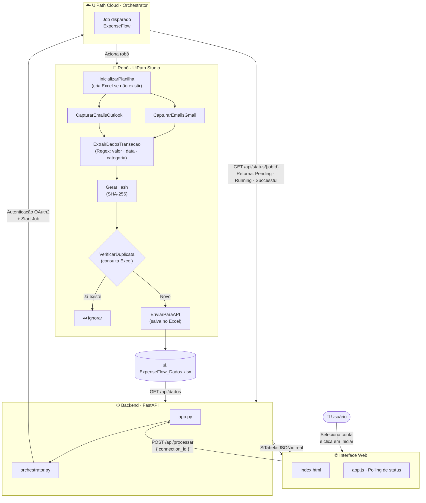

# 💰 ExpenseFlow — Plataforma Web

Interface web para disparar o processo RPA de gestão financeira.
O usuário seleciona a conta de e-mail e o robô UiPath captura, extrai
e categoriza automaticamente as transações financeiras.

---

## 🗂️ Arquitetura



---

## 📋 Pré-requisitos

Cada membro do grupo precisa ter instalado:

- [UiPath Studio](https://www.uipath.com/start-trial) — Community Edition (gratuito)
- [Python 3.10+](https://www.python.org/downloads/)
- Conta no [UiPath Automation Cloud](https://cloud.uipath.com) (gratuito)
- Conta Gmail ou Outlook configurada no UiPath Integration Service

---

## ⚙️ Configuração passo a passo

### 1. Clonar / abrir o projeto

Coloque a pasta do projeto em qualquer diretório da sua máquina.

> ⚠️ O projeto **não depende de caminho fixo** — funciona em qualquer lugar.

---

### 2. Instalar dependências Python

```bash
cd web-platform/backend
pip install -r requirements.txt
```

---

### 3. Criar o arquivo `.env`

Na pasta `web-platform/backend/`, copie o `.env.example` e renomeie para `.env`:

```bash
cp .env.example .env
```

Abra o `.env` e preencha com suas credenciais:

```ini
ORCHESTRATOR_URL=https://cloud.uipath.com
UIPATH_ORG=seu_org
UIPATH_TENANT=seu_tenant
UIPATH_CLIENT_ID=seu_client_id
UIPATH_CLIENT_SECRET=seu_client_secret
UIPATH_FOLDER_ID=seu_folder_id
UIPATH_PROCESS_NAME=ExpenseFlow

CONTA_1_LABEL=seu_email@gmail.com
CONTA_1_ID=xxxxxxxx-xxxx-xxxx-xxxx-xxxxxxxxxxxx
```

**Como obter cada credencial:**
| `UIPATH_ORG` e `UIPATH_TENANT` | URL do Cloud: `cloud.uipath.com/{ORG}/{TENANT}/` |
| `UIPATH_CLIENT_ID` e `CLIENT_SECRET` | Admin → External Applications → Add Application (tipo Confidential, escopos: `OR.Jobs`, `OR.Folders`, `OR.Execution`) |
| `UIPATH_FOLDER_ID` | Orchestrator → Pastas → clique na pasta → ID na URL |
| `CONTA_1_ID` | UiPath Studio → Integration Service → Connections → clique na conexão |

---

### 4. Configurar a conexão de e-mail no UiPath

Cada membro precisa conectar sua própria conta:

1. Abra o projeto no **UiPath Studio**
2. Vá em **Integration Service → Connections → Add Connection**
3. Escolha **Gmail** ou **Outlook 365** e autentique com sua conta
4. Copie o **Connection ID** gerado e adicione ao `.env` como `CONTA_1_ID`

---

### 5. Verificar a planilha Excel

O arquivo `ExpenseFlow/Dados/Template_ExpenseFlow.xlsx` já vem com o projeto formatado.
A aba **`Transacoes`** deve ter exatamente estas colunas na linha 1:

| HASH | DATA | CATEGORIA | DESCRICAO | ORIGEM | FORMAPAG | VALOR |
|------|------|-----------|-----------|--------|----------|-------|

> O robô cria automaticamente o arquivo de dados na primeira execução a partir do template. Não é necessário criar manualmente.

---

### 6. Publicar o robô no Orchestrator

1. No UiPath Studio, clique em **Publish**
2. Selecione seu tenant no Orchestrator
3. Acesse **Orchestrator → Processos** e confirme que `ExpenseFlow` aparece na lista

---

### 7. Rodar o backend

```bash
cd web-platform/backend
python app.py
```

Acesse no navegador: [http://localhost:8000](http://localhost:8000)

---

## 🌐 Endpoints da API

| `GET`  | `/api/contas` | Lista as contas configuradas no `.env` |
| `POST` | `/api/processar` | Dispara o robô no Orchestrator |
| `GET`  | `/api/status/{job_id}` | Verifica o status de um job em execução |
| `GET`  | `/api/dados` | Retorna as transações do Excel em JSON |
| `GET`  | `/api/download` | Faz download do arquivo Excel |
| `GET`  | `/api/health` | Status do servidor e configurações |

---

## ❓ Erros comuns

| Erro | Causa provável | Solução |
|------|----------------|---------|
| `Nenhuma conta configurada` | `.env` sem `CONTA_1_LABEL` / `CONTA_1_ID` | Preencha o `.env` (ver Passo 3) |
| `Falha na autenticacao: 401` | `CLIENT_ID` ou `CLIENT_SECRET` incorretos | Revise as credenciais no UiPath Cloud |
| `Processo 'ExpenseFlow' nao encontrado` | Robô não publicado ou `FOLDER_ID` errado | Publique o robô (Passo 6) e verifique o `FOLDER_ID` |
| `Nenhum dado encontrado` | Robô ainda não executado | Execute o robô pela interface primeiro |
| `Connections.View permission denied` | Robô sem permissão na conexão | Orchestrator → Integration Service → compartilhe a conexão com o robô |

---

## 🔒 Segurança

- **Nunca** commite o arquivo `.env` — ele contém suas credenciais pessoais
- O `.env.example` é o único arquivo de configuração que deve ir ao repositório
- Cada membro usa suas **próprias** credenciais — sem conflito entre integrantes

Adicione ao `.gitignore`:

```
.env
__pycache__/
*.pyc
```